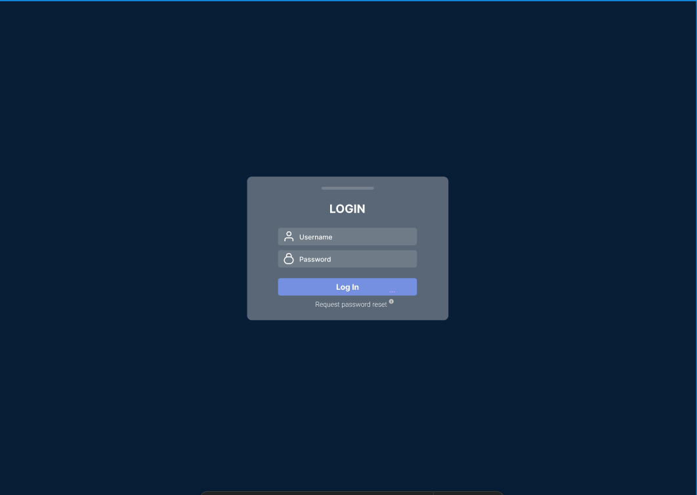
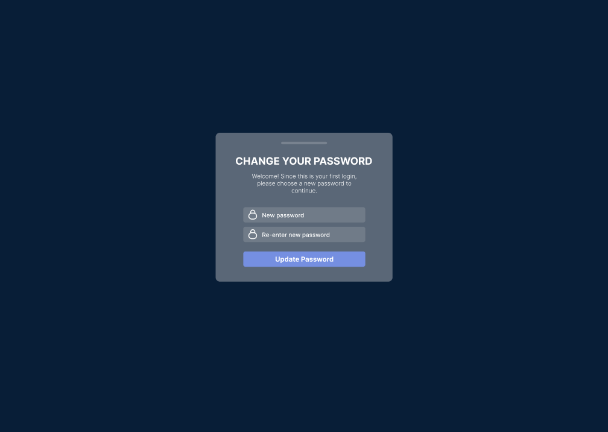

# login pages
this is the html, js and css for these pages but there's no logic or validation checks.

there's 3 pages for the login section:
 ### 1. login.php 
Fields: username and password
  
  
### 2. request_reset.php
for when the user forgets their password. Has new password and re-enter password fields. they'd only see this page after the admin resets their password to a default one. 
  
### 3. reset_password.php
Has new password and re-enter password fields. this shows up when it's the user's first time logging in and they'd hv to change from the default password to one of their choice. 
- the reset_password.php is the same as request_reset.php but with a "welcome" msg at the top.

